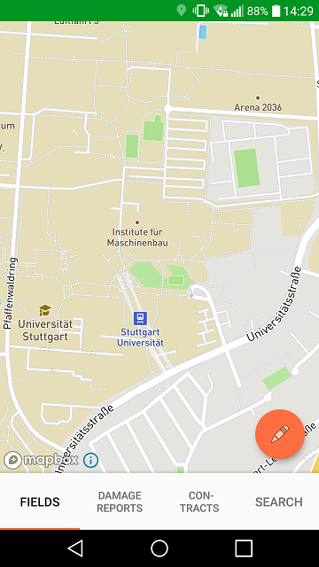
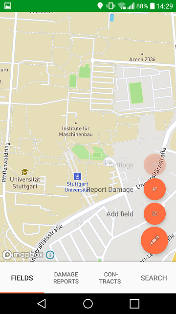
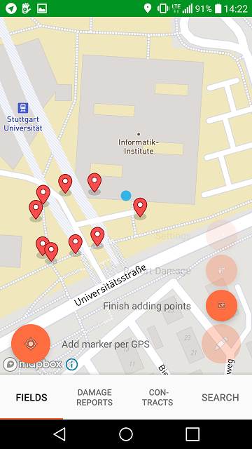
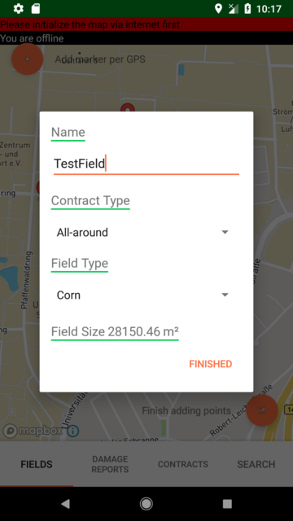
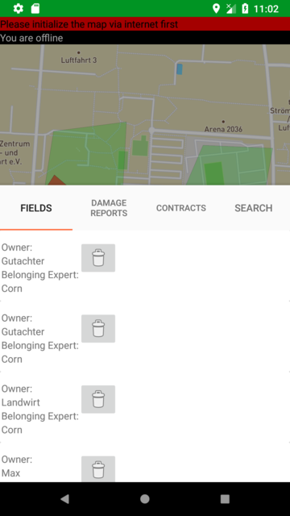
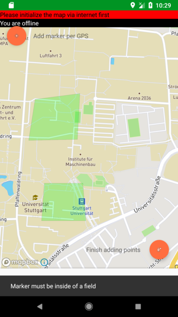
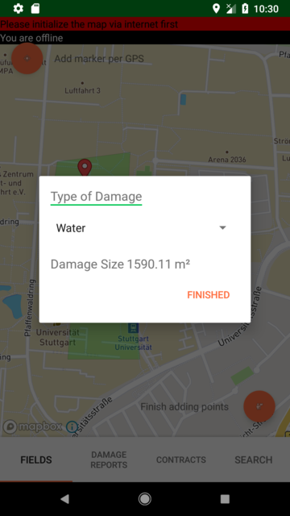
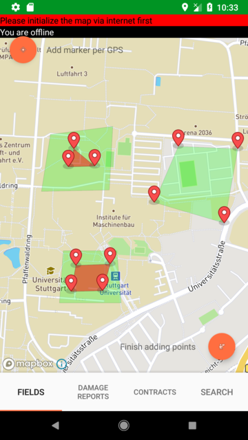
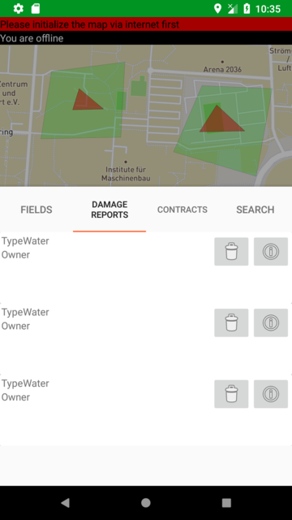

# FSKEA - Einfach. Genau. Papierlos. Jeder Landwirt wird es lieben!

Unsere FSKEA-App nach Login

Landwirte versichern ihre Felder gegen verschiedenste Schäden.
Ein wichtiger Parameter ist die Fläche des Feldes und die Region in der das Feld bewirtschaftet wird.
Kommt es zu einem Schaden, müssen Gutachter oder Landwirte die genaue Position und Abmessungen des Schadens erfassen können und den Sachbeareitern in der Versicherung übermitteln können.

Und genau dafür ist unsere App da. Man kann mit der App sowohl mit Touch als auch automatisch Positionsdaten eine Feld bzw. Schaden auf der Karte erstellen lassen und verwalten.

## Bereits implementierte Features

## Features

##### Critical Feature

### Felderfassung

### Felderverwaltung

### Schadenfallerfassung

### Schadensfallvisualisierung

### Schadensfallverwaltung

#### Additional Feature

## Noch nicht implementierte Features
Hier ist aufgelistet, welche Features im nächsten Sprint implementiert werden
### Datenaustausch

Der Landwirt hat die Möglichkeit seine Schadensfälle zu exportieren, sodass der Gutachter diese in sein Handy einspielen kann. Durch diese Möglichkeit kann der Gutachter up-to-date bleiben und Änderungen dies der Versicherung melden.

### Internationalität
- Möglichkeit die App in verschiedenen Sprachen anzuzeigen
### Zentrieren von Feldern/ Schadensfälle auf Karte
- Möglichkeit die Karte auf ein bestimmtes Feld oder Schadensfall zentrieren
### Neue Benutzer anlegen
### bestehende Felder ändern
- Man kann die Felder bearbeiten:
 - Größe, Art, Gutachter etc.
### Farben für Felder ändern
- Möglichkeit die Farbe der Felder je nach Feldtyp anpassen
### Suche erweitern
- Möglichkeit nach Feldtypen, Schadensarten etc. suchen

## Installation
Anleitung für Android Studio:
1. Repository klonen: `git clone`

Nachdem man Android Studio gestartet hat wählt man den punkt:
Check out project form Version Control, dann git.

In diesem Schritt muss die URL auf das Projekt vom Git Repository eingegeben werden. Mittels Test, kann man testen, ob die URL stimmt.
Als nächstes gibt man den Pfad ein, indem das lokale Repository gespeichert werden soll.
Zuletzt gibt man noch den namen des lokalen Ordners ein. Dann klickt man auf clone.

2. Android Studio Projekt öffnen

Mit dem Schritt davor ist auch automatisch das Projekt startbereit. Somit erspart man sich diesen manuellen Schritt.
3. Android Studio Projekt bauen

Oben rechts im Editor findet man eine Leiste wie auf dem Bild. Sobald alles geladen ist ( das dropbown menü zeigt kein rotes x mehr), kann man das Projekt bauen:

man Klickt auf Build und dann auf Make Project.

4. Android Studio Projekt im Emulator ausführen oder APK erstellen lassen
- Im Emulator starten:

Man klickt auf das 4. letzte Symbol von rechts. Dann muss man ein Virtual Device erstellen:

Nachdem man dies erstellt hat. Kann man wieder im Editor auf den grünen Pfeil klicken:

Dann wählt man das virtuel Device aus, wartet bis die App gesptartet hat und los gehts.
Wenn man ein echtes Gerät mittels USB eingesteckt hat und dort den Develepor modus aktiviert hat, kann man auch dieses Gerät dort auswählen.

- APK erstellen

Unter Build findet man auch den Menüpunkt Build APK. Dies klickt man an.

## Verwendung der App

Die Landwirte haben es schon schwer, dass Sie mit seinen Feldern genügen Ertrag und somit ihren Unterhalt bestreiten können. Zusätzlich werden die wird u.A Deutschland immer mehr bürokratischer und dadurch muss eben auch mehr Papiere ausgefüllt werden.

Dazu kommt noch, dass die Versicherung immer mehr und genauerere Daten von den Landwirten benötigt. Und genau da kommt unsere App ins Spiel.

### Genaue Daten für die Versicherung

Mit unserem App ist es später möglich die Felder und Schadensfälle so genau wie möglich in die Karte anzuzeigen und zu speichern.
Die Vorteile für den Landwirt:
- Dokumentation seiner Felder und Schadensfälle
- Abgleich der Daten mit der Versicherung
- Die Flächen können mit GPS erstellt werden, somit ist sicher gegeben, dass die Flächen auch genau so groß sind, wie sie in der Realität sind
- Es erspart dem Landwirt und auch dem Gutachter ärger, falls die falsche Fläche an die Versicherung weiter gegeben wurde

### Eigene Dokumentation
Auch der Landwirt interessiert sich für seine eigenen Felder und Hageschläden. Durch unsere App hat er die Möglichkeit
- Vergangene Schadensfälle auch nach mehreren Jahren aufzurufen
- Er kann seinen Ertrag mit der Fläche über die Jahre vergleichen
- Er kann sich mit der Dokumentation in den nächsten Jahren überlegen, welches Getreide er anpflanzt, sodass bei möglichen weiteren Schaden am wenigsten kaputt geht.

## Changelog

Die Entwicklungsgeschichte befindet sich in [CHANGELOG.md](CHANGELOG.md).

## Verwendete Bibliotheken
- [MapBox](https://github.com/mapbox/mapbox-gl-native)

- [AndroidSlidingUpPanel](https://github.com/umano/AndroidSlidingUpPanel)
## Lizenz

- Apache License, Version 2.0 für die Verwendung des Slidermenüs
- MIT Lizenz für die Verwendung von MapBox

Genaue Bedingungen der Lizenz können in [LICENSE](LICENSE) nachgelesen werden.

## Teamwork

### Entwicker

| Andrew Almaguer| st152650@stud.uni-stuttgart.de |

| Stefan Zindl | st148777@stud.uni-stuttgart.de |

| Aimn Ahmed | st150637@stud.uni-stuttgart.de |

### Betreuer
| Verena Käfer |
| ----------|
| Kai Mindermann |

### Tutor
|Jingxi Zhang |
