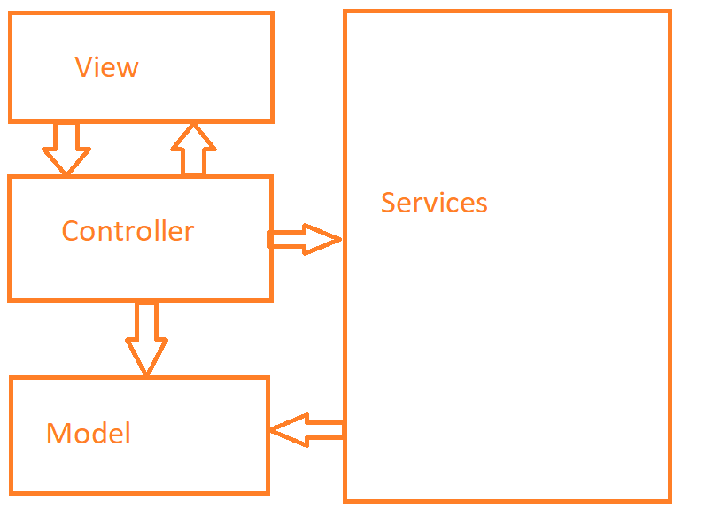
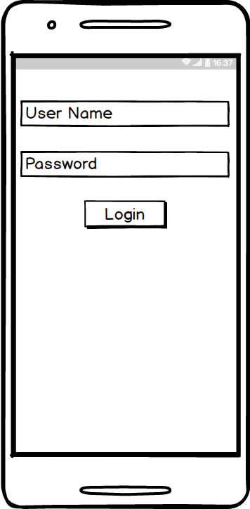

# Einführung

Dieser Entwurf legt unsere Lösungsstruktur fest und enthält alles, was wir benötigen, um einen Überblick über die ganze App zu bekommen.

Unsere App ist in vier große Teile aufgebaut:
- View
- Controller
- Model
- App-Services

Wir haben die App so aufgebaut, damit es möglich ist verschiedene Features gleichzeigt programmieren zu können. Somit kann jedes Team-Mitglied unabhängig von anderen arbeiten.

## Verwendete Entwurfsmuster:
### MVC ###
Wir benutzen das Entwurfsmuster MVC, da wir die Aufgaben unabhängig von anderen Gruppenmitgliedern arbeiten können.

### Service-Provider
Im Package Service werden über AppRegistry Services bereitgestellt, die von der ganzen App aus zugreifbar sind. Dadurch ist es möglich gespeicherte Daten von einem Ort zu holen.

# Komponentendiagramm

## Services
Im ersten Phase unserer Impementierung haben wir die Struktur unserer Services vereinfacht, da es für diesen Zustand und Umfang unserer App Sinn macht. Nichts desto trotz möchten wir diese Struktur in unserem Entwurf beibehalten, da wir diese Struktur umsetzen möchten, sobard die App eine gewisse Größe erreicht hat und es uns dadurch Unabhängigkeit verschafft.
### Beschreibung
Die Komponente Services stellt die bereitgestellten Services als Unterkomponente bereit. Dazu gehört zum Beispiel der Map-Service.

Das Ziel ist es, dass einfach weitere Services hinzugefügt und ausgetauscht werden können, z.B. wenn man verschiedene Libraries für eine Karte bereitstellen möchte. Zusätzlich wird das drei Schichtenmodell gewährleistet.

### Bereitgestellte Interfaces
    -ServiceProvider
    -DataServiceProvider
    -CacheServiceProvider
    -MapServiceProvider
    -MapBoxProvider
    -SetupProvider

## View

In der View werden alle seperaten Views hinzugefügt. Im LoginView haben wir das Setup integriert, da manche services einen Context benötigten und es so sinnvoll ist.

## Controller

In dieser Komponente werden alle Klassen drin sein, welche die Logik für die View bereitstellt und Zusätlich das Bindeglied zu den Services und Models, welche in der View dargestellt werden.

# Klassendiagramm
In diesem Kapitel werden die Klassen in Packages gegliedert.

### Beschreibung

Im Package Setup werden nur die Services initialisiert. Die Viewmodels können von der Klasse aus, auf die verschiedenen Services zugreifen.

## View
In diesem Package werden alle Views bereitsgestellt. In userem Fall entspricht dies unseren Activities.

## Viewmodel
In dem Package Viewmodel wird die Logik der Views bereitgestellt.

## Model

In diesem Package werden alle Models bereitgestellt.
Grundsätzlich haben wir 3 "Hauptmodels"
 - User
 - Field
 - DamageEvent

Diese benötigen die Helfer-Models siehe Diagramm.

## Services
Alle benötigten Services erben am Ende vom Interface AppService. Damit ist es möglich mittels einem Dictionary auf die benötigten AppServices zugreifen zu können.

### MapService
Der MapService hat u.A. folgende Funktionen:
- Map-Bibliothek bereitstellen
- Felder berechnen
- Schäden berechnen
- Mapdaten aktualisieren
- Funktionen speichern

Es ist die zentrale Komponente alle Features zu realisieren, die mit der Karte arbeiten. Dieser Service wird noch im weiteren Verlauf aufgebaut, und somit die MapActivity refaktort.

### DataService
Im Dataservice werden alle weiteren Daten bereitgestellt. Dazu gehören:
- Nutzerprofile
- Verträge
- Angemeldeter Benutzer

Im Prinzip werden hier alle Daten abgerufen, die nichts mit der Karte zu tun hat und wichtig sind zu speichern.

### CacheService
Im CacheService werden Daten abgelegt, welche Zwischengespeichert werden sollen. Dazu gehört z.b.:
- Heruntergeladene Karten, um einen schnelleren Zugriff zu erlauben

### ConfigService
In diesem Service werden alle Daten gespeichert, welche benutzerspezifisch sind:
- Benutzerpräferenzen wie  z.B.: automatisch anmelden.

### DataStorageService
Dieser Service ist das Bindeglied für die lokale Datenhaltung. Dadurch ist es möglich die Art des Speicherns einfacher beeinflussen zu können.
Arten der Speicherung:
- Datenbank
- XML
- Textdateien

Zusätzlich werden dort die Export- und Import- Funktionen bereitgestellt.
Jeder andere Service greift auf diesen zu, um Daten persistent zu speichern.

## User
Die Klasse User und deren Subklassen Gutachter und Landwirt stellen die Benutzer dar. Sie beschreiben welche Funktionen die rollen benutzen können.
Z.B.: 
- Gutachter:
- Zugriff auf Felder von allen Landwirten

- Landwirt:
- Zugriff nur auf seine eigenen Feldern

# GUI-Skizze

Startansicht: Login

Die Loginpage wird angezeigt, wenn man die App startet. Nach dem Login können folgende Features genutzt werden.

Feature 1.1 & 1.2 : Felderfassung und Feldvisualisierung

Das Hinzufügen eines Eckpunktes kann entweder per Touch oder GPS (durch Touch auf ) realisiert werden.

Feature 1.3 : Felderverwaltung

Durch Drücken auf ein Feld oder ein Button im Menüpunkt, werden weitere Informationen angezeigt:
- Details über das Feld
- Schadensfälle, die zum Feld gehören

Die Felder werden mit verschiedenen Farben dargestellt. Dies hilft dem Benutzer die Informationen schneller zuzuordnen.

Feature 2.1 & 2.2 : Schadensfallerfassung & Schadensfallvisualisierung

Das Hinzufügen der Schadensposition kann entweder per Touch oder GPS (durch Touch auf  ) realisiert werden.  
Beim Hinzufügen von Fotos wird man durch ein Intent zur Kamera-App weitergeleitet.

Feature 2.3 : Schadensfallverwaltung

Durch Drücken auf eine Schadensmarkierung oder ein Button im Menüpunkt, kommt man zu mehr Informationen von den aktiven bzw. auch zu den schon bearbeiteten Schadensfällen. Die Farbe zeigt den aktuellen Status.

Feature 1.4 & 2.4 : Datenaustausch

Man hat die Möglichkeit die Dateien zu exportieren oder sie direkt per Email zu versenden. Zusätzlich kann man auch Dateien importieren.
