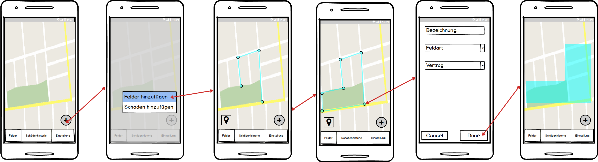
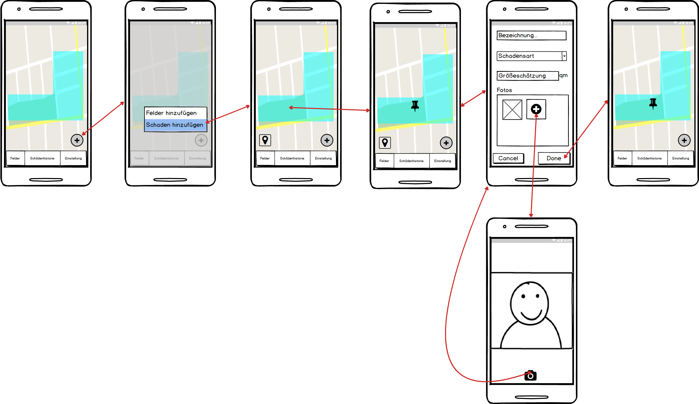
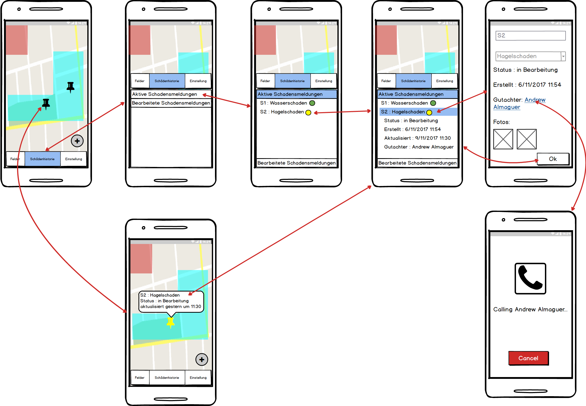
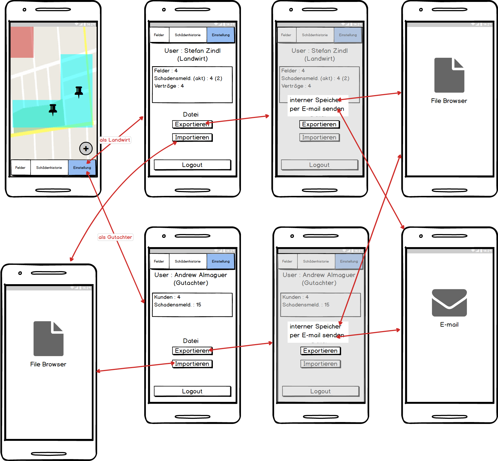

# Einführung

Dieser Entwurf legt unsere Lösungsstruktur fest und enthält alles, was wir benötigen, um einen Überblich über die ganze App zu bekommen.

Unsere App ist in vier große Teile aufgebaut:
- View
- Viewmodel
- Model
- App-Services

![Gubaer at the German language Wikipedia [GFDL (http://www.gnu.org/copyleft/fdl.html) or CC-BY-SA-3.0 (http://creativecommons.org/licenses/by-sa/3.0/)], via Wikimedia Commons](images/General-AppStructure.png)

## Verwendete Entwurfsmuster:
### View-Viewmodel-Model ###
MVVM wird in diesem Projekt verwendet, da dadurch sichergestellt wird, dass die App unabhängig von der GUI getestet werden kann.

### Polymorphie
Die Polymorphie wird für das Konstrukt für die AppServices ausgenutzt. Dadurch gibt es die Möglichkeit die verschiedenen Services über das Interface "AppService" zugreifen zu können.

# Komponentendiagramm

**TODO:** Komponentendiagramm der eigenen und externen Komponenten der App erstellen. EINFÜGEN

## Services

### Beschreibung
In der Komponente werden alle Services bereitgestellt, die die App verwendet und benutzt.

### Bereitgestellte Interfaces
AppService
DataService
CacheService
MapService

## Komponente 2

**TODO:** Beschreibung der Komponente inklusive seiner verwendeten und bereitgestellten Schnittstellen

## Externe Komponente 1

### Mapbox
Es wird die Bibliothek Mapbox für die Funktionen bereitgestellt:
- Kartenmaterial
- Funktionen Punkte in die Karte zu wählen
- weitere Funktionen

# Klassendiagramm

![Gubaer at the German language Wikipedia [GFDL (http://www.gnu.org/copyleft/fdl.html) or CC-BY-SA-3.0 (http://creativecommons.org/licenses/by-sa/3.0/)], via Wikimedia Commons](images/Klassendiagramm.png)

Gubaer at the German language Wikipedia [GFDL (http://www.gnu.org/copyleft/fdl.html) or CC-BY-SA-3.0 (http://creativecommons.org/licenses/by-sa/3.0/)], via Wikimedia Commons

**TODO:** Klassendiagramm der Aufteilung der eigenen Komponenten in Klassen darstellen.

## Beschreibung der wichtigen Klassenhierarchie 1

### AppServices
Alle benötigten Services erben am Ende vom Interface AppService. Damit ist es möglich mittels einem Dictionary auf die benötigten AppServices zugreifen zu können.

## Beschreibung der wichtigen Klasse 2
### DataService
Im DataService werden alle Daten, die gespeichert und geladen werden müssen.

### MapService
Im MapService werden alle benötigten Funktionen von der Library MapBox bereitgestellt.

### Role
Die Klasse Role und deren Subklassen Gutachter und Landwirt stellen die Benutzer dar. Sie beschreiben für die Rollen, welche Funktionen sie benutzen können.
z.B.:
- Gutachter:
    - Zugriff auf Felder von allen Landwirte

- Landwirt:
    - Zugriff nur auf seine eigene Felder

## Beschreibung der wichtigen Klasse 3

# GUI-Skizze

Feature 1.1 & 1.2 : Felderfassung und Feldvisualisierung

Beim Enkpunkthinzüfugen, kann man entweder per Touch oder GPS (durch Touch auf ) einen Punkt hinzufügen.

Feature 1.3 : Felderverwaltung

Durch Touch auf ein Feld oder Navigation-Menu kommt man zur mehr Informationen von den Feldern und den gehörenden Schadensfällen.  Farben hilft der Nutzer die Informationen schneller erfassen.

Feature 2.1 & 2.2 : Schadensfallerfassung & Schadensfallvisualisierung

Beim Hinzufügen von Schadensposition, kann man Entweder per Touch oder GPS (durch Touch auf  ) die Position bestimmen.  Beim Hinzufügen von Fotos ist man durch ein Intent zum Camera-App weitergeleitet.

Feature 2.3 : Schadensfallverwaltung

Durch Touch auf ein Schadenmarker oder Navigation-Menu kommt man zur mehr Informationen von den aktiven und schon bearbeiteten Schadensfällen.  Farben zeigt aktuelle Status.

Feature 1.4 & 2.4 : Datenaustausch

Beim Exportieren ist es möglich auf dem Gerät zu speichern oder direct per E-Mail schicken.  Beim importieren soll die Datei schon im Gerätspeicher sein.
