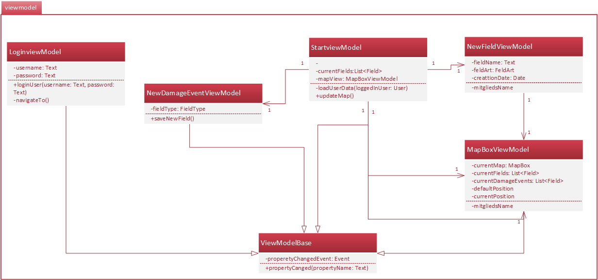

# Einführung

Dieser Entwurf legt unsere Lösungsstruktur fest und enthält alles, was wir benötigen, um einen Überblich über die ganze App zu bekommen.

Unsere App ist in vier große Teile aufgebaut:
- View
- Viewmodel
- Model
- App-Services

Wir haben die App so aufgebaut, damit es möglich ist verschiedene Features gleichzeigt programmieren zu können. Somit kann jedes Team-Mitglied unabhängig von anderen arbeiten.

## Verwendete Entwurfsmuster:
### Model View View-Model ###
MVVM wird in diesem Projekt verwendet, da dadurch sichergestellt wird, dass die App unabhängig von der GUI getestet werden kann.

### Service-Provider
Im Package Service werden über AppRegistry Services bereitgestellt, die von der ganzen App aus zugreifbar sind. Dadurch ist es möglich gespeicherte Daten von einem Ort zu holen und zu speichern.

# Komponentendiagramm

## Services

### Beschreibung
Die Komponente Services beinhaltet die Unterkomponente und stellt alle Services bereit, die die App verwendet. Zum Beispiel der Map-Service stellt alle Funktionen von der Library (u.A z.B. MapBox und die Berechnung der Felder, Schäden) bereit.

Das Ziel ist es, dass die Anzahl Services einfach erweiterbar sind und austauschbar. Z.b, wenn man verschiedene Libraries für eine Karte bereitstellen möchte. Zusätzlich wird das drei Schichtenmodell gewährleistet.

### Bereitgestellte Interfaces
    -ServiceProvider
    -DataServiceProvider
    -CacheServiceProvider
    -MapServiceProvider
    -MapBoxProvider
    -SetupProvider

## View

In der View werden alle seperaten Views hinzugefügt.

## Viewmodel

In dieser Komponente werden alle Klassen drin sein, welche die Logik für die View bereitstellt.

## Setup

In der Komponente Setup werden die Services und andere Einstellungen für die spätere Verwendung vorbereitet.

# Klassendiagramm
In diesem Kapitel werden die Klassen in Packages gegliedert.
## Setup

### Beschreibung

Im Package Setup werden nur die Services initialisiert. Von dort werden die Viewmodels die Services zugreifen und verwenden.

## View
In diesem Package werden alle Views bereitsgestellt. In userem Fall entspricht dies unseren Activities.

## Viewmodel
In dem Package Viewmodel wird die Logik der Views bereitgestellt.

## Model

In diesem Package werden alle Models bereitgestellt.
Grundsätzlich haben wir 3 "Hauptmodels"
 - User
 - Field
 - DamageEvent

Diese benötigen die Helfer-Models siehe Diagramm.

## Services
Alle benötigten Services erben am Ende vom Interface AppService. Damit ist es möglich mittels einem Dictionary auf die benötigten AppServices zugreifen zu können.

### MapService
Im MapService hat folgende Funktion:
- wird die Map-Bibliothek bereitstellen
- Felder berechnen
- Schäden berechnen
- Mapdaten aktualisieren
- die Funktionen speichern

### DataService
Im Dataservice werden alle Daten gespeichert und bereitgestellt dazu gehören:
- Nutzerprofile
- Verträge
- Angemeldeter Benutzer

Im Prinzip werden hier alle Daten abgerufen, die nichts mit der Karte zu tun hat.

### CacheService
Im CacheService werden Daten gespeichert, die Zwischengespeichert werden sollen. Dazu gehört z.b.:
- Heruntergeladene Karten für die Offline Nutzung

### ConfigService
In diesem Service werden alle Daten gespeichert, welche benutzerspezifisch sind:
- Benutzerpräferenzen wie automatisch anmelden.

### DataStorageService
Dieser Service ist das Bindeglied für die lokale Datenhaltung. Dadurch ist es möglich die Art des speichern einfach beeinflussen zu können, Arten:
- Datenbank
- XML
- Textdateien

Zusätzlich werden dort die Export- und Import- Funktionen bereitgestellt.

## User
Die Klasse User und deren Subklassen Gutachter und Landwirt stellen die Benutzer dar. Sie beschreiben für die Rollen, welche Funktionen sie benutzen können.
z.B.: 
- Gutachter:
    - Zugriff auf Felder von allen Landwirte

- Landwirt:
    - Zugriff nur auf seine eigene Felder

# GUI-Skizze

Startansicht: Login

Die Loginpage wird angezeigt, wenn man die App startet. Nach dem Login können folgende Features genutzt werden.

Feature 1.1 & 1.2 : Felderfassung und Feldvisualisierung

Beim Enkpunkthinzüfugen, kann man entweder per Touch oder GPS (durch Touch auf ) einen Punkt hinzufügen.

Feature 1.3 : Felderverwaltung

Durch Touch auf ein Feld oder Navigation-Menu kommt man zur mehr Informationen von den Feldern und den gehörenden Schadensfällen.  Farben hilft der Nutzer die Informationen schneller erfassen.

Feature 2.1 & 2.2 : Schadensfallerfassung & Schadensfallvisualisierung

Beim Hinzufügen von Schadensposition, kann man Entweder per Touch oder GPS (durch Touch auf  ) die Position bestimmen.  Beim Hinzufügen von Fotos ist man durch ein Intent zum Camera-App weitergeleitet.

Feature 2.3 : Schadensfallverwaltung

Durch Touch auf ein Schadenmarker oder Navigation-Menu kommt man zur mehr Informationen von den aktiven und schon bearbeiteten Schadensfällen.  Farben zeigt aktuelle Status.

Feature 1.4 & 2.4 : Datenaustausch

Beim Exportieren ist es möglich auf dem Gerät zu speichern oder direct per E-Mail schicken.  Beim importieren soll die Datei schon im Gerätspeicher sein.
